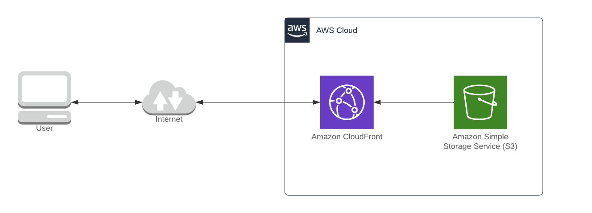

# S2 - Simple Site

Static website hosted on AWS S3 with high availability (HA) and content distribution network (CDN)

## Objective

It's pretty common that when you starts your project you want to tell eveyone about your awesome idea, but in general your budget is reduced.
In general good ideas could be shown with a fancy static HTML sites.

The current market is dominated by Wordpress which is an excellent content editor with tons of plugins and useful features, but the content sent to the browser is, in general, generated on the fly by PHP. This affects the page's load time and forces you to put that into a webserver wich in general is more expensive than having the HTML files on an object storage.

AWS S3 is an unexpensive object repository that could be used to store HTML, css, js and assets as images or videos. And Cloudfront is a really good CDN that combined with S3 is a perfect way to serve your static corporative site.

## Setup

The infrastructure setup is pretty simple. It's composed by cloudfront and S3.
The infrastructure deployment is automatized using Terraform with basic security checks on the terraform code provided by trivy as part of a pre-commit set of hooks.

## Cost caluclations

The monthly infrastructure costs were calculated having the following data as example:

- Bucket size:  ~1343Mb
- Average page size: 1376.2Kb
- Number of pages: 1000
- Average requests per month: 50000
- Region: us-east-1
- Regions that consumes the website: US, Europe, South America

With the data provided above we can obtain an estimation similar to this one: <https://calculator.aws/#/estimate?id=9ad857c6ac63f748272895c709213116905fd5a3>

An aproximate cost of $2.88 per year!!

This does not includes the services:

- Web Application Firewall (WAF): as it's an static site, the application does not requires any protection because the content is static. Eventually it could be enabled to mitigate DDoS attacks.
- Cloudwatch: site access logging is not required. You count with more interesting tools to have access information like Google Analytics.
- KMS: the S3 bucket does not requires to be encrypted because all information in the bucket is public.
- S3 Versioning: S3 versioning is disabled because the evolution of changes on the website could be stored on a source control management like github, and the content deployment could be automatically conducted by a CI/CD tool.
